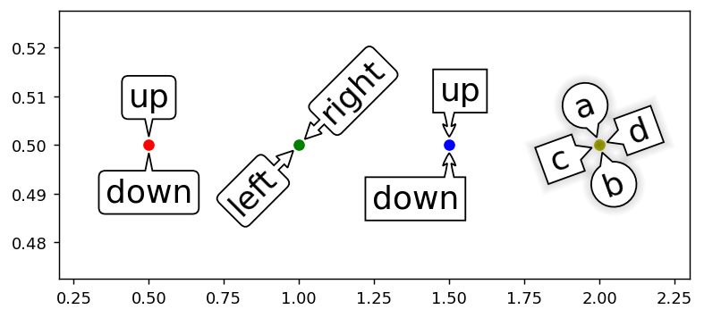

Welcome to mpl_speech_bubble's documentation!
===================================================================

A module to annotate with a speech bubble in Matplotlib:

Installation
^^^^^^^^^^^^^

.. code-block:: bash

   pip install mpl_speech_bubble

Getting Help
^^^^^^^^^^^^

.. toctree::
   :maxdepth: 3

   examples/index
   API
   Contributing

Indices and tables
==================

* :ref:`genindex`
* :ref:`modindex`
* :ref:`search`
